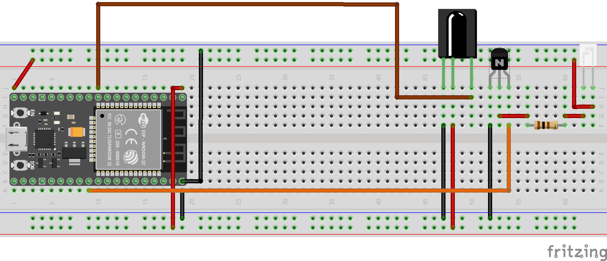
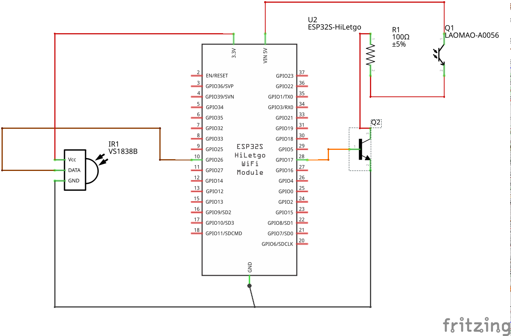
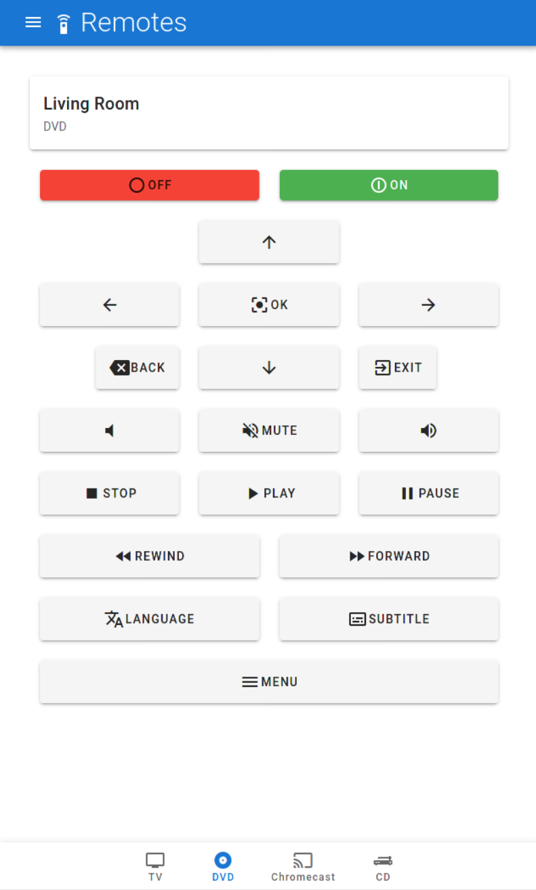

# ESP32 Remote #

This repository includes code for an IR remote configurable controller. It connects to an MQTT server
and allows to play Scenes. Currently, the following protocols are supported:

- Infrared NEC
- Infrared RC6
- Onkyo EISCP protocol

The firmware runs on an ESP32. It doesn't require additional external PSRAM, at least with the configration provided
here. Most of the python code is directly embedded in the Micropython library. If you want to run everything directly
from the file system, additional PSRAM might be advisable.

## Hardware Layout ##

## Installation ##

You require an MQTT broker for communication.

For configuration, you should put a `config.json` in the root directory and copy the `main.py` file in there too.

An example of the `config.json` can be found [here](config.example.json).

## Preliminary Software ##

For fully using this application, there also exists a cloud backend and frontend:

- The backend is written in Go and is available [here](https://github.com/cbrand/ir-remote-backend).
- The frontend is written in TypeScript and Vue.js and is availalable [here](https://github.com/cbrand/ir-remote-frontend).

## Caveats ##

I couldn't get with the newest version of micropython propper client side certificates to run. I am not quite sure what the root cause
is and stepped down to authenticate with username and password to the broker. However, if anybody can point me to the issue I would gladly
fix this.

## Used Libraries ##

Some libraries are directly embedded in the repository, but have been taken from somewhere else. For easier reference these are:

### [mqtt_as.py](modules/mqtt_as.py) ### 

Slightly modified for rebooting the whole ESP32 on various connection issues after an unsuccesful connection as in my experience wrapping
an TLS connection on the ESP32 runs in an endless loop of reconnection issues. My best guess is that something in the TLS pipeline isn't releasing
resources without a hard reboot.

### [ntptime.py](modules/ntptime.py) ###

Retrieved from the ESP8266 code base in micropython, it is used to initially synchronize the esp clock on reboot and reconnect.

## License ##

The code is licensed via the MIT license.
